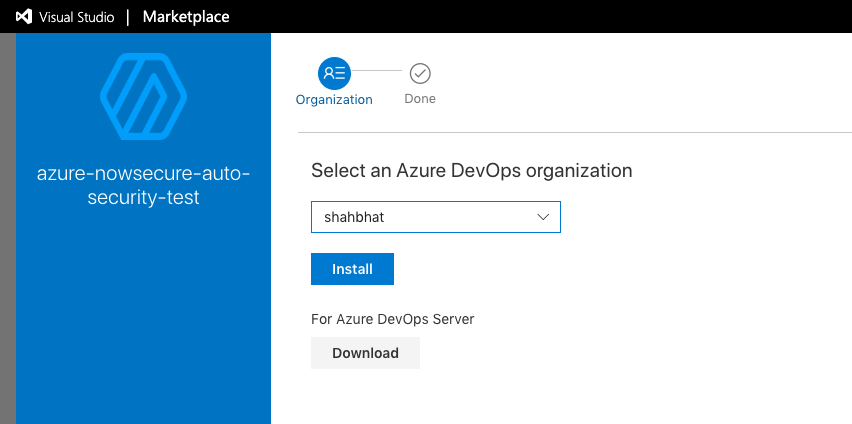
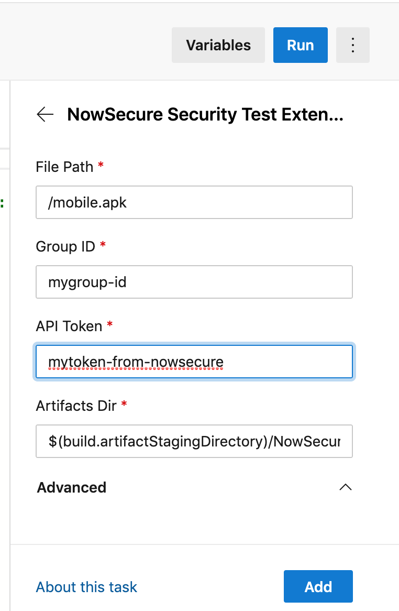

## Azure Extension for NowSecure Auto API

### Installation

#### Find it in Azure Devops Marketplace [https://marketplace.visualstudio.com/azuredevops] using "NowSecure Security Test Extension"


Then install it as follows:


#### Add to your Build

#### Basic Config


#### Advanced Config


#### Sample Build Pipeline for Android
```
pool:
  vmImage: 'macOS 10.13'

steps:
- task: Gradle@2
  inputs:
    workingDirectory: ''
    gradleWrapperFile: 'gradlew'
    gradleOptions: '-Xmx3072m'
    publishJUnitResults: false
    testResultsFiles: '**/TEST-*.xml'
    tasks: 'assembleDebug'
- task: CopyFiles@2
  inputs:
    contents: '**/*.apk'
    targetFolder: '$(build.artifactStagingDirectory)'
- task: PublishBuildArtifacts@1
  inputs:
    pathToPublish: '$(build.artifactStagingDirectory)'
    artifactName: 'drop'
    artifactType: 'container'
- task: azure-nowsecure-auto-security-test@1
  inputs:
    artifactsDir: '$(build.artifactStagingDirectory)/NowSecureArtifacts'
    filepath: '/Users/vsts/agent/2.155.1/work/1/a/app/build/outputs/apk/app-prod-debug.apk'
    group: 'xxxxx'
    waitMinutes: 60
    showStatusMessages: true
    score: 75
    token: 'xxxxx'
- task: PublishBuildArtifacts@1
  inputs:
    pathToPublish: '$(build.artifactStagingDirectory)'
    artifactName: 'NowSecureArtifacts'
    artifactType: 'container'
```

