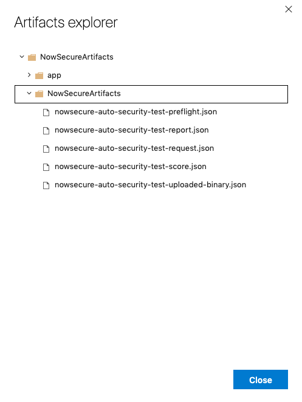
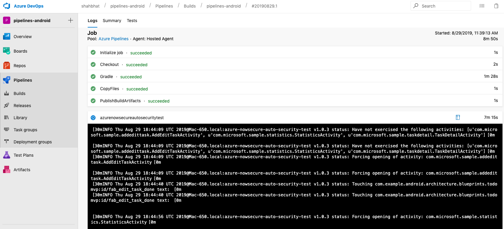
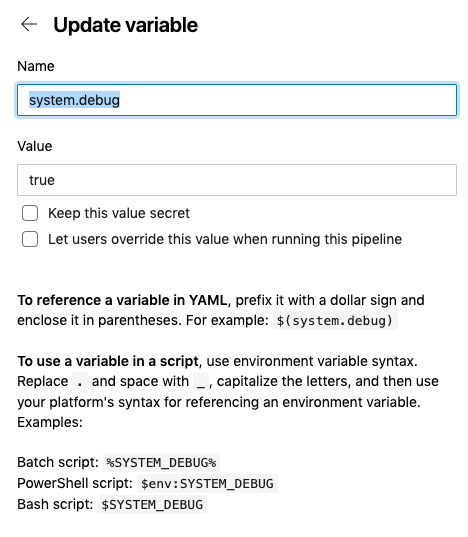

## NowSecure Azure Extension 
NowSecure provides purpose-built, fully automated mobile application security testing (static and dynamic) for your development pipeline. By testing your mobile application binary post-build from Gitlab, NowSecure ensure comprehensive coverage of newly developed code, third party components, and system dependencies. NowSecure quickly identifies and details real issues, provides remediation recommendations, and integrates with ticketing systems such as Gitlab and Jira. This integration requires a NowSecure platform license. See https://www.nowsecure.com for more information.

## Job Parameters
To add this component to your CI/CD pipeline, the following should be done:
- Get a token from your NowSecure platform instance.  More information on this can be found in the [NowSecure Support Portal](https://support.nowsecure.com/hc/en-us/articles/7499657262093-Creating-a-NowSecure-Platform-API-Bearer-Token)
- Identify the ID of the group in NowSecure Platform that you want your assessment to be included in.  More information on this can be found in the [NowSecure Support Portal](https://support.nowsecure.com/hc/en-us/articles/6290991166605-Getting-Started-with-Groups#h_01G396F6CTEZ4P6G5Z1FDGJ12K). (Note: Authentication required to access this page)
- Add a CI/CD variable to your project named, `NS_TOKEN` and add the token created above.  As this is a credential, be sure to set the variable as `Masked and Hidden`.
-  Add the following include entry to your project's CI/CD configuration and set your input values 

    ```yaml
    - task: azure-nowsecure-auto-security-test@<tag>
      inputs:
        binary_file: '<path-to-binary>'
        group: '<group-ref>'
        token: $NS_TOKEN
    ```

   - `<tag>` is the release tag you want to use ([releases list](https://gitlab.com/nowsecure/eng/platform-infrastructure/nowsecure-ci-component/-/releases)). 

   - `<group-ref>` is uuid of the group that will be used to trigger assessments. Information on how to get the group reference can be found in the [NowSecure Support Portal](https://support.nowsecure.com).
   - `<path-to-binary>` is the filepath for the ipa / apk that is to be uploaded to run an assessments against. Ideally this will be an artifact of some previous build step in a pipeline.
   - `$NS_TOKEN` is the token used to communicate with the NowSecure API. This token should be a [Gitlab CI/CD variable](https://docs.gitlab.com/ci/variables/#define-a-cicd-variable-in-the-ui). Information on how to create a token can be found in the [NowSecure Support Portal](http://support.nowsecure.com/).


### Installation

Find it in [Azure Devops Marketplace](https://marketplace.visualstudio.com/azuredevops) using "NowSecure Security Test Extension"


Then install it as follows:


#### Add to your Build

#### Basic Config


#### Advanced Config


#### Sample Build Pipeline for Android
```yaml
pool:
  vmImage: 'ubuntu-latest'

steps:
- task: Gradle@4
  inputs:
    cwd: ''
    wrapperScript: 'gradlew'
    gradleOpts: '-Xmx3072m'
    publishJUnitResults: false
    testResultsFiles: '**/TEST-*.xml'
    tasks: 'assembleDebug'
- task: CopyFiles@2
  inputs:
    contents: '**/*.apk'
    targetFolder: '$(build.artifactStagingDirectory)'
- task: PublishBuildArtifacts@1
  inputs:
    pathToPublish: '$(build.artifactStagingDirectory)'
    artifactName: 'drop'
    artifactType: 'container'
- task: azure-nowsecure-auto-security-test@1
  inputs:
    # Required inputs
    group: "0000-00000-0000-0000"
    token: $NS_TOKEN
    binary_file: "path-to-artifact.apk"
    # Common optional parameters
    minimum_score: 70
    analysis_type: static
    polling_duration_minutes: 30
```
Note: "task: azure-nowsecure-auto-security-test@1" is the main task for security analysis and other tasks above are used to generate Android apk file.

#### Publish/View Artifacts
You can add task to publish artifacts (API results) from Nowsecure security task as follows
```yaml
- task: PublishBuildArtifacts@1
  inputs:
    pathToPublish: '$(build.artifactStagingDirectory)'
    artifactName: 'nowsecure'
    artifactType: 'container'
```

You can view artifacts from the build output such as:



#### View Output logs



#### Debugging
- Add variable for system.debug=true in your build to see more detailed logs, e.g.,

